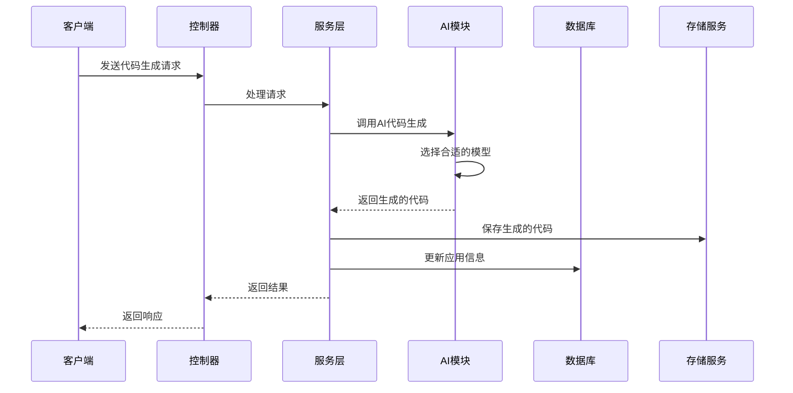

# AI Code Generator 项目 Wiki

## 1. 项目概览

AI Code Generator 是一个基于大语言模型的代码生成系统，能够根据用户的自然语言描述生成各种类型的代码，包括HTML代码、多文件代码和Vue项目代码。该系统采用微服务架构，提供了完整的代码生成、部署和管理功能。

- **核心功能**：代码生成（HTML、多文件、Vue项目）、应用管理、代码部署、项目下载
- **技术栈**：Spring Boot 3.5.4、Java 21、LangChain4J、Redis、MySQL、S3存储
- **应用场景**：快速原型开发、前端代码生成、全栈应用构建

## 2. 目录结构

项目采用模块化的微服务架构，主要分为以下几个模块：

```text
/workspace
├── ai-code-generator-microservice/  # 微服务模块
│   ├── ai-code-ai/              # AI相关功能实现
│   ├── ai-code-app/             # 应用管理服务
│   ├── ai-code-client/          # 客户端服务
│   ├── ai-code-common/          # 公共模块
│   ├── ai-code-model/           # 模型定义
│   ├── ai-code-screenshot/      # 截图服务
│   └── ai-code-user/            # 用户服务
├── grafana/                     # 监控配置
├── prometheus/                  # 监控配置
├── sql/                         # 数据库脚本
├── src/                         # 主应用源码
│   ├── main/java/com/goblin/aicodergenerater/  # 主代码目录
│   └── main/resources/          # 资源文件
└── pom.xml                      # 主项目依赖配置
```

### 主要模块职责

| 模块 | 主要职责 | 文件位置 |
|------|---------|----------|
| AI模块 | 代码生成核心逻辑，与大模型交互 | [ai-code-ai](file:///workspace/ai-code-generator-microservice/ai-code-ai/src/main/java/com/goblin/aicodegenerator) |
| 应用模块 | 应用管理、部署、下载 | [ai-code-app](file:///workspace/ai-code-generator-microservice/ai-code-app/src/main/java/com/goblin/aicodegenerator) |
| 用户模块 | 用户认证、权限管理 | [ai-code-user](file:///workspace/ai-code-generator-microservice/ai-code-user/src/main/java/com/goblin/aicodeuser) |
| 公共模块 | 通用工具、异常处理、配置 | [ai-code-common](file:///workspace/ai-code-generator-microservice/ai-code-common/src/main/java/com/goblin/aicodegenerator) |
| 截图模块 | 网页截图功能 | [ai-code-screenshot](file:///workspace/ai-code-generator-microservice/ai-code-screenshot/src/main/java/com/goblin/aicodegenerator) |

## 3. 系统架构与主流程

AI Code Generator 采用分层架构设计，主要包括以下几个层次：

1. **表现层**：控制器（Controller）处理HTTP请求，返回响应
2. **业务逻辑层**：服务（Service）实现核心业务逻辑
3. **数据访问层**：Mapper 处理数据库操作
4. **AI交互层**：与大语言模型交互，处理代码生成请求
5. **工具层**：提供各种工具类和辅助功能

### 核心流程图



## 4. 核心功能模块

### 4.1 代码生成模块

代码生成模块是系统的核心功能，支持生成HTML代码、多文件代码和Vue项目代码。该模块通过LangChain4J与大语言模型交互，实现了流式生成和非流式生成两种方式。

**主要功能**：
- 生成HTML代码
- 生成多文件代码
- 生成Vue项目代码
- 流式响应支持

**核心类**：
- [AiCodeGeneratorService](file:///workspace/src/main/java/com/goblin/aicodergenerater/ai/AiCodeGeneratorService.java)：定义了代码生成的核心接口
- [AiCodeGenTypeRoutingService](file:///workspace/src/main/java/com/goblin/aicodergenerater/ai/AiCodeGenTypeRoutingService.java)：根据请求类型选择合适的AI模型

### 4.2 应用管理模块

应用管理模块负责管理用户创建的应用，包括创建、更新、删除和查询应用信息。

**主要功能**：
- 创建应用
- 更新应用信息
- 删除应用
- 查询应用列表
- 应用详情查看

**核心类**：
- [AppController](file:///workspace/src/main/java/com/goblin/aicodergenerater/controller/AppController.java)：处理应用相关的HTTP请求
- [AppService](file:///workspace/src/main/java/com/goblin/aicodergenerater/service/AppService.java)：实现应用管理的业务逻辑

### 4.3 代码部署模块

代码部署模块负责将生成的代码部署到服务器上，提供访问URL。

**主要功能**：
- 部署Vue项目
- 生成访问URL
- 管理部署状态

**核心类**：
- [ServeDeployService](file:///workspace/src/main/java/com/goblin/aicodergenerater/serve/ServeDeployService.java)：处理代码部署逻辑
- [ServeLifecycleManager](file:///workspace/src/main/java/com/goblin/aicodergenerater/serve/ServeLifecycleManager.java)：管理部署的生命周期

### 4.4 项目下载模块

项目下载模块允许用户下载生成的代码，方便本地开发和部署。

**主要功能**：
- 打包生成的代码
- 提供下载链接

**核心类**：
- [ProjectDownloadService](file:///workspace/src/main/java/com/goblin/aicodergenerater/service/ProjectDownloadService.java)：处理项目下载逻辑

## 5. 核心 API/类/函数

### 5.1 控制器类

| 类名 | 功能描述 | 主要方法 | 文件位置 |
|------|---------|----------|----------|
| AppController | 应用管理控制器 | addApp, updateApp, deleteApp, chatToGenCode, deployApp | [AppController.java](file:///workspace/src/main/java/com/goblin/aicodergenerater/controller/AppController.java) |
| UserController | 用户管理控制器 | login, register, update, getCurrentUser | [UserController.java](file:///workspace/src/main/java/com/goblin/aicodergenerater/controller/UserController.java) |
| ChatHistoryController | 聊天历史控制器 | getChatHistoryList | [ChatHistoryController.java](file:///workspace/src/main/java/com/goblin/aicodergenerater/controller/ChatHistoryController.java) |

### 5.2 服务类

| 类名 | 功能描述 | 主要方法 | 文件位置 |
|------|---------|----------|----------|
| AiCodeGeneratorService | AI代码生成服务 | generateHtmlCode, generateMultiFileCode, generateVueProjectCodeStream | [AiCodeGeneratorService.java](file:///workspace/src/main/java/com/goblin/aicodergenerater/ai/AiCodeGeneratorService.java) |
| AppService | 应用管理服务 | createApp, updateApp, deleteApp, chatToGenCode, deployApp | [AppService.java](file:///workspace/src/main/java/com/goblin/aicodergenerater/service/AppService.java) |
| UserService | 用户管理服务 | login, register, getLoginUser | [UserService.java](file:///workspace/src/main/java/com/goblin/aicodergenerater/service/UserService.java) |
| ProjectDownloadService | 项目下载服务 | downloadProjectAsZip | [ProjectDownloadService.java](file:///workspace/src/main/java/com/goblin/aicodergenerater/service/ProjectDownloadService.java) |

### 5.3 工具类

| 类名 | 功能描述 | 主要方法 | 文件位置 |
|------|---------|----------|----------|
| CodeParser | 代码解析工具 | parseHtmlCode, parseMultiFileCode | [CodeParser.java](file:///workspace/src/main/java/com/goblin/aicodergenerater/ai/core/CodeParser.java) |
| CodeFileSaver | 代码保存工具 | saveHtmlCode, saveMultiFileCode | [CodeFileSaver.java](file:///workspace/src/main/java/com/goblin/aicodergenerater/ai/core/CodeFileSaver.java) |
| WebScreenshotUtils | 网页截图工具 | takeScreenshot | [WebScreenshotUtils.java](file:///workspace/src/main/java/com/goblin/aicodergenerater/utils/WebScreenshotUtils.java) |

## 6. 技术栈与依赖

| 技术/依赖 | 版本 | 用途 | 来源 |
|-----------|------|------|------|
| Spring Boot | 3.5.4 | 应用框架 | [pom.xml](file:///workspace/pom.xml) |
| Java | 21 | 开发语言 | [pom.xml](file:///workspace/pom.xml) |
| LangChain4J | 1.3.0 | AI模型交互 | [pom.xml](file:///workspace/pom.xml) |
| MyBatis Flex | 1.11.1 | ORM框架 | [pom.xml](file:///workspace/pom.xml) |
| Redis | - | 缓存、会话存储 | [application.yml](file:///workspace/src/main/resources/application.yml) |
| MySQL | - | 数据库 | [application.yml](file:///workspace/src/main/resources/application.yml) |
| S3 | - | 对象存储 | [application.yml](file:///workspace/src/main/resources/application.yml) |
| Selenium | 4.33.0 | 网页截图 | [pom.xml](file:///workspace/pom.xml) |
| Prometheus | - | 监控 | [prometheus.yml](file:///workspace/prometheus/prometheus.yml) |
| Grafana | - | 监控可视化 | [grafana_config.json](file:///workspace/grafana/grafana_config.json) |

## 7. 配置、部署与开发

### 7.1 配置文件

项目的主要配置文件为 `application.yml`，包含以下配置：

- 数据库连接配置
- Redis配置
- AI模型配置
- S3存储配置
- 服务器配置

### 7.2 部署步骤

1. **环境准备**：
   - Java 21
   - MySQL
   - Redis
   - S3兼容的对象存储

2. **数据库初始化**：
   - 执行 `sql/create_table.sql` 创建数据库表

3. **配置修改**：
   - 修改 `application.yml` 中的配置信息

4. **构建与运行**：
   - 构建：`mvn clean package`
   - 运行：`java -jar target/ai-coder-generater-0.0.1-SNAPSHOT.jar`

### 7.3 开发流程

1. **代码生成流程**：
   - 用户发送代码生成请求
   - 系统根据请求类型选择合适的AI模型
   - AI模型生成代码
   - 系统解析并保存生成的代码
   - 返回生成结果给用户

2. **应用部署流程**：
   - 用户请求部署应用
   - 系统检查应用代码是否存在
   - 系统部署应用到服务器
   - 返回部署URL给用户

## 8. 监控与维护

### 8.1 监控系统

项目集成了 Prometheus 和 Grafana 进行监控：

- **Prometheus**：收集系统指标
- **Grafana**：可视化监控数据

### 8.2 常见问题与解决方案

| 问题 | 可能原因 | 解决方案 |
|------|---------|----------|
| 代码生成失败 | AI模型调用失败 | 检查网络连接和API密钥 |
| 部署失败 | 代码目录不存在 | 先生成代码再部署 |
| 下载失败 | 权限不足 | 确保用户是应用的创建者 |
| 性能问题 | 并发请求过多 | 调整系统配置和限流策略 |

## 9. 总结与亮点回顾

AI Code Generator 是一个功能完整的代码生成系统，具有以下亮点：

1. **多模型支持**：集成了多种AI模型，根据任务复杂度选择合适的模型
2. **流式响应**：支持流式生成，提升用户体验
3. **完整的应用生命周期管理**：从创建到部署到下载的全流程支持
4. **微服务架构**：模块化设计，便于维护和扩展
5. **监控系统**：集成Prometheus和Grafana，实现系统监控

该系统为开发者提供了一个高效、便捷的代码生成工具，能够大大提高开发效率，减少重复工作。通过自然语言描述即可生成高质量的代码，为快速原型开发和前端开发提供了有力支持。